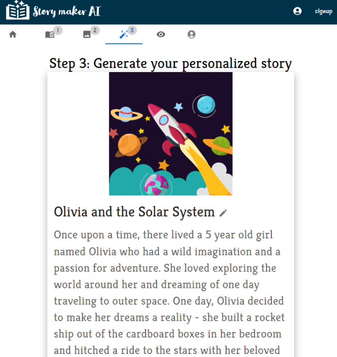

# story-maker-AI

[](https://opensource.org/licenses/MIT)

## Description

The Story Maker AI App is a web application that uses OpenAI's language model to generate unique and creative stories based on user inputs. This application also uses DALL-E to generate unique images through user input description.


## Link to Application

Application available at: https://story-maker-ai.herokuapp.com/

## Table of Contents

- [Installation](#installation)
- [Usage](#usage)
- [Features](#features)
- [License](#license)
- [Contributing](#contributing)
- [Tests](#tests)
- [Questions](#questions)
- [Credits](#credits)

## Installation

To run the application, first make sure you have Node.js installed on your machine. Then, clone the repository and install the dependencies:

```
npm install
```

## Usage

The Story Maker AI App is divided into 3 steps, each of which prompts the user for specific information to be included in the generated story.

## Features

To use the app, simply click on the first step and enter the required information. Once you've completed all the steps, you can view and print you final story.

- Step 1 - Story description - input character, theme, elements, scenary.
- Step 2 - Generate a personalized image by providing a description in the form.
- Step 3 - View your final story and image and the ability to print this card.
- Step 4 - View as an e-book - turn the pages and interact online
<p>
  
</p>
- Create an account and save your stories to your profile.

## License

[](https://opensource.org/licenses/MIT)

This application is covered by MIT license, available at:
https://opensource.org/licenses/MIT

## Contributing

Please feel free to send a pull request, the following is my GitHub account: https://github.com/Renatatims

## Tests

To run the application:

```
npm run develop
```

## Questions

If you have any questions please contact me at:

- GitHub account:https://github.com/Renatatims
- e-mail account: renatatims@gmail.com

## Credits

### Images

- Animals Images by pch.vector on Freepik: "https://www.freepik.com/free-vector/happy-funny-cartoon-animals-set_8609221.htm#query=animals%20ilustration&position=8&from_view=search&track=robertav1_2_sidr"
- Book Page template, from: https://www.canva.com/templates/EAFdM1RZDII-minimalist-vintage-line-a4-stationery-paper-document/

- Characters:
<a href="https://www.freepik.com/free-vector/ten-little-kids-characters-group_24631772.htm#query=kids%20cartoon%20different%20races&position=45&from_view=search&track=ais">Image by gstudioimagen1</a> on Freepik

- Seasonal Images:
Easter: Image by <a href="https://www.freepik.com/free-vector/flat-easter-element-collection_12673212.htm#query=cute%20easter&position=11&from_view=search&track=ais">Freepik</a>

Mother's Day:  <a href="https://www.freepik.com/free-vector/happy-mothera-s-day-beautiful-mother-daughter-character-hand-drawn-cartoon-art-illustration_14478867.htm#query=cute%20mothers%20day&position=13&from_view=search&track=ais">Image by mamewmy</a> on Freepik

Father's Day: Image by <a href="https://www.freepik.com/free-vector/father-s-day-background-with-cute-bears_2192729.htm#query=cute%20fathers%20day&position=15&from_view=search&track=ais">Freepik</a>

Birthday: Image by <a href="https://www.freepik.com/free-vector/happy-birthday-illustration-concept_7040382.htm#query=cute%20happy%20birthday&position=14&from_view=search&track=ais">Freepik</a>

4th of July: Image by <a href="https://www.freepik.com/free-vector/fourth-july_4478497.htm#query=cute%204th%20of%20july&position=5&from_view=search&track=ais">Freepik</a>

Halloween: Image by <a href="https://www.freepik.com/free-vector/flat-halloween-element-collection-white-background_5396179.htm#query=cute%20halloween&position=0&from_view=search&track=ais">Freepik</a>

Thanksgiving: <a href="https://www.freepik.com/free-vector/happy-thanksgiving-lettering-design_6046987.htm#query=thanksgiving&position=2&from_view=search&track=sph">Image by pikisuperstar</a> on Freepik

Christmas: Image by
 <a href="https://www.freepik.com/free-vector/hand-drawn-christmas-element-collection_10755945.htm#query=cute%20holiday&position=7&from_view=search&track=ais">Freepik</a>


- [OpenAI API](https://openai.com/)
- [DALLE ](https://openai.com/dall-e/)
